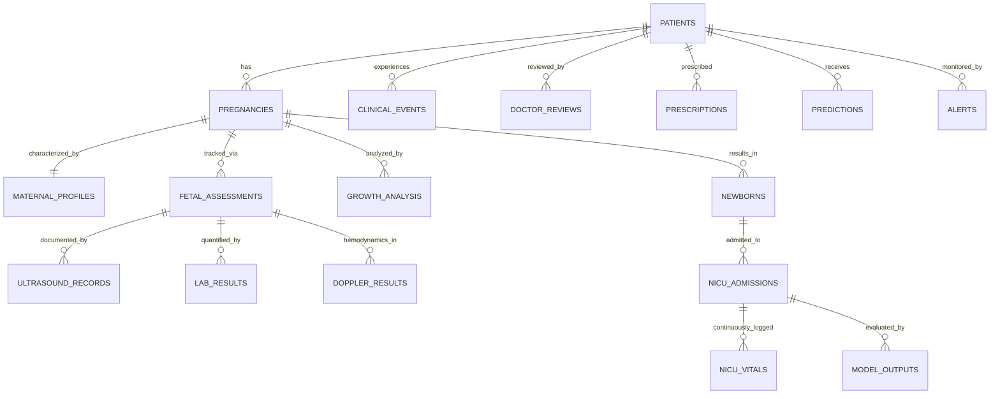

# Synthetic Longitudinal Dataset Metadata

**Project**: NeoNatal Watch AI  
**Dataset Version**: 1.0 (Academic Demonstration)  
**Creation Date**: September 22, 2026  
**Classification**: 100% SYNTHETIC / ACADEMIC DEMONSTRATION DATA  

---

## 1. Dataset Purpose
This synthetic dataset was generated exclusively for the academic development, end-to-end testing, and architectural validation of the **NeoNatal Watch AI** platform. It enables complete demonstration of the longitudinal patient journey:
- Maternal booking and profile
- First-trimester combined screening and biometry
- Early first-trimester AI growth prediction
- Mid-trimester actual biometric follow-up
- Predicted vs. actual growth trajectory analysis
- Longitudinal clinical events, clinician reviews, and prescriptions
- Delivery and newborn outcomes
- Postnatal NICU admission and high-frequency physiological vital monitoring
- Multimodal deterioration alerts and machine learning explainability audit trails

---

## 2. Academic / Demo-Only Warning & Disclaimers

> [!CAUTION]
> **NOT REAL PATIENT DATA — NOT FOR CLINICAL USE**  
> All records in this dataset are entirely artificial, simulated, and synthetic. They do NOT represent real human patients, clinical trials, or hospital medical records. Any resemblance to real persons, living or deceased, or actual medical events is purely coincidental.
>
> This data MUST NOT be used for real clinical decision-making, diagnostic guidance, patient triage, treatment planning, or formal medical device certification.
>
> The distributions and parameters in this dataset are demonstration values designed to verify software pipeline functionality and do NOT claim to represent true epidemiological or clinical population distributions.

---

## 3. Dataset Size & Scope
- **Synthetic Patients**: 6 unique synthetic patient profiles (`P-SYN-001` through `P-SYN-006`)
- **Pregnancies**: 6 corresponding pregnancy episodes (`101` through `106`)
- **CSV Data Files**: 17 domain files under `data/synthetic/`
- **Total Relational Records**: 139 records across all tables
- **Target Database Parity**: 100% column-name and data-type alignment with SQLAlchemy models and MySQL database schema.

---

## 4. Scenario Descriptions

| Scenario ID | Patient ID | Clinical Demonstration Scenario | Key Features |
|---|---|---|---|
| **Scenario A** | `P-SYN-001` | Normal Longitudinal Pregnancy & Outcome | Low maternal risk, concordant 1st/2nd trimester growth (50th percentile), full-term vaginal delivery (3350g), no NICU admission needed. |
| **Scenario B** | `P-SYN-002` | Fetal Growth Restriction (FGR) Deviation | Normal 1st trimester prediction (48th percentile), decoupled 2nd trimester actual growth (22nd percentile, -26% variance), induced late-preterm birth (2450g), short NICU observation for feeding. |
| **Scenario C** | `P-SYN-003` | Vascular & Doppler-Related Growth Lag | Abnormal 1st trimester uterine artery PI (2.25) and low PlGF (24.5 pg/mL), predicted FGR risk 0.68, persistent notch and umbilical artery resistance, low-dose aspirin prescribed, preterm delivery (2080g), NICU CPAP. |
| **Scenario D** | `P-SYN-004` | Maternal Comorbid Risk Pattern | Chronic essential hypertension (MAP 108 mmHg) and Type 2 diabetes, high preeclampsia/FGR risk score (0.76), labetalol and aspirin therapy, elective cesarean at 36.5w (2550g), NICU hypoglycemia surveillance. |
| **Scenario E** | `P-SYN-005` | Severe Preterm Delivery & Intensive NICU Telemetry | Normal early pregnancy followed by acute PPROM at 32w, very preterm delivery (1620g), Level III NICU admission with Respiratory Distress Syndrome, 11 vital sign readings with desaturation episodes (SpO2 83%), high-severity alert triggered. |
| **Scenario F** | `P-SYN-006` | Ongoing / Active Pregnancy Cohort | Currently active gestation (estimated due date Feb 2027), 20-week anatomy scan normal, demonstrates handling of ongoing pregnancies with NULL delivery/newborn records. |

---

## 5. File Manifest & Entity Relationships

The dataset is organized across 17 relational CSV files:

1. **`patients.csv`** (6 rows) — Master patient identifiers and demographic placeholders.
2. **`pregnancies.csv`** (6 rows) — Gestational episodes, conception dates, estimated due dates, and statuses.
3. **`maternal_profiles.csv`** (6 rows) — Maternal baseline age, BMI, MAP, chronic hypertension, and diabetes flags.
4. **`fetal_assessments.csv`** (12 rows) — First and second-trimester biometric observations (CRL, NT, EFW percentiles).
5. **`ultrasound_records.csv`** (12 rows) — Imaging references, structural surveys, and formal scan findings.
6. **`lab_results.csv`** (6 rows) — First-trimester biochemical serum analytes (PAPP-A, PlGF, free beta-hCG).
7. **`doppler_results.csv`** (12 rows) — Hemodynamic pulsatility indices (uterine and umbilical arteries).
8. **`predictions.csv`** (6 rows) — Early AI forecast outputs, risk scores, and ensemble breakdown.
9. **`growth_analysis.csv`** (6 rows) — Trajectory variance calculations (predicted vs actual percentiles).
10. **`clinical_events.csv`** (10 rows) — Longitudinal clinical milestones, screens, and labor episodes.
11. **`doctor_reviews.csv`** (8 rows) — Clinician assessments, risk classifications, and formal recommendations.
12. **`prescriptions.csv`** (4 rows) — Clinical management regimens (vitamins, aspirin, labetalol).
13. **`newborns.csv`** (5 rows) — Delivery outcomes, gestational age at birth, weight, and birth status.
14. **`nicu_admissions.csv`** (4 rows) — Postnatal admissions, clinical indications, and discharge records.
15. **`nicu_vitals.csv`** (26 rows) — Time-series physiological telemetry (HR, SpO2, RR, temperature).
16. **`model_outputs.csv`** (6 rows) — Explainability references and intermediate model representations.
17. **`alerts.csv`** (4 rows) — Clinical alerts, severity levels, triggering factors, and clinician acknowledgments.

---

## 6. Generation Methodology
- Deterministic parametric modeling based on standard gestational milestones (Fetal Medicine Foundation 11-13w parameters, Hadlock growth percentiles).
- Explicit relational keys with unique synthetic IDs (`P-SYN-xxx`, `SYN-PREG-xxx`, `SYN-NB-xxx`).
- Strict chronological sequencing: Conception Date < 1st Trimester Scan < Prediction Timestamp < 2nd Trimester Scan < Growth Analysis < Delivery Date < NICU Admission < NICU Vitals < Discharge Date.
- No random noise that violates biological physiological bounds.

---

## 7. Limitations
- Synthetic data cannot be used to evaluate real-world machine learning generalizability or prospective clinical accuracy.
- Time-series frequency in NICU vitals is compressed (26 records) to maintain lightweight performance on standard development environments.
- Laboratory assays represent idealized typical numbers rather than instrument-specific calibration variations.

